# 🏭 Üretim Performans Takip Sistemi (MVP)

Bu proje, otomotiv yan sanayi enjeksiyon kalıplama (injection molding) hatlarındaki performansı vardiya bazında takip etmek için geliştirilmiş Full-Stack bir web uygulamasıdır. 

## 📌 Projenin Amacı
MES (Manufacturing Execution System) sisteminden otomatik üretilen ham `.csv` formatındaki günlük üretim raporlarını içeri aktarmak, bu verileri detaylı kalite süzgeçlerinden geçirerek **anomalileri/hataları tespit etmek** ve %100 temizlenmiş onaylı veriyi OEE metrikleriyle birlikte **harici bir REST API (Magna)** hedefine senkronize etmektir.

---

## 🚀 Hızlı Kurulum Talimatları

Projeyi bilgisayarınızda çalıştırmak için aşağıdaki adımları sırasıyla terminalinizde uygulayın:

**1. Repoyu Klonlayın ve Klasöre Girin:**
```bash
git clone https://github.com/<kullanici-adiniz>/selinavci-uretim-takip-case.git
cd selinavci-uretim-takip-case
```

**2. Çevresel Değişkenleri (.env) Ayarlayın:**
```bash
cp .env.example .env
```
*(Not: `.env` dosyasını bir metin editörüyle açıp `API_KEY` kısmına size verilen gizli anahtarı giriniz.)*

---

## ⚡ Hızlı Çalıştırma Talimatları

Proje iki katmandan (Backend ve Frontend) oluşmaktadır. İki ayrı terminal penceresi açmanız gerekmektedir.

**Terminal 1: Backend (FastAPI)**
```bash
cd backend
pip install -r requirements.txt
uvicorn main:app --reload
```
*(Backend `http://localhost:8000` adresinde çalışmaya başlayacaktır. API Dokümantasyonu için `http://localhost:8000/docs` adresini ziyaret edebilirsiniz.)*

**Terminal 2: Frontend (React & Vite)**
```bash
cd frontend
npm install
npm run dev
```
*(Frontend `http://localhost:5173` adresinde çalışacaktır. Tarayıcınızdan bu adrese giderek uygulamayı kullanmaya başlayabilirsiniz.)*

---

## 📸 Uygulama Ekran Görüntüleri

### 1. CSV Veri Yükleme (Import)
Uygulama, verileri içe aktarırken kullanıcıya adım adım rehberlik eder:
* **Başlangıç:** <br> 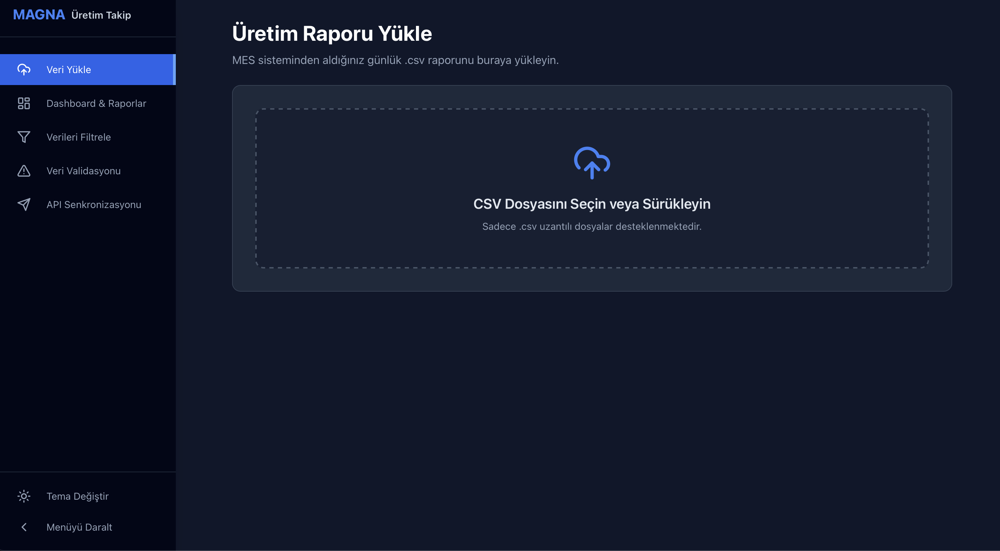 <br> Kapsamlı sürükle-bırak (drag & drop) destekli boş dosya yükleme alanı.
* **Önizleme:** <br> 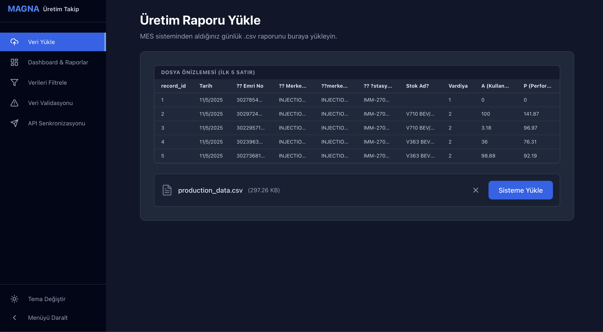 <br> Dosya seçildiği an backend'e yollanmadan önce tarayıcıda ilk 5 satırın önizlemesinin gösterildiği aşama.
* **Sonuç Raporu:** <br> 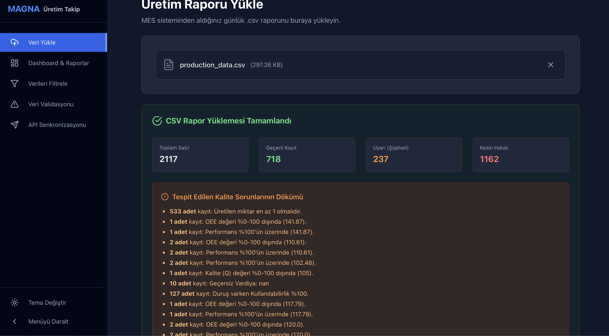 <br> Dosya yüklendikten sonra; kaç satırın geçerli, kaç satırın şüpheli veya kesin hatalı olduğunu ve kalite sorunlarının detaylı dökümünü gösteren sonuç ekranı.

### 2. Dashboard ve Analitik Raporlar
Üretim verilerinin tüm açılardan analiz edildiği, PDF olarak indirilebilir/yazdırılabilir gelişmiş yönetim paneli:

* **Genel Performans ve Trendler:** <br> 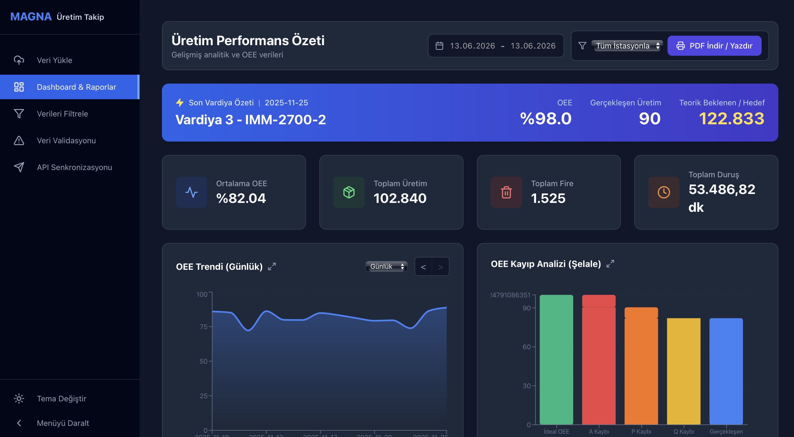
  * **Filtreler ve Dışa Aktarma:** İş istasyonu bazlı dinamik filtreleme, tarih aralığı seçimi ve **PDF İndir/Yazdır** butonu.
  * **Canlı Vardiya Özeti:** Sisteme girilen en son vardiyanın OEE ve Üretim özetini gösteren dikkat çekici bilgi kartı.
  * **Kritik KPI Kartları:** Ortalama OEE, Toplam Üretim, Toplam Fire ve Toplam Duruş (dk) metrikleri.
  * **OEE Trend Grafiği:** Günlük ve Haftalık olarak görünümü değiştirilebilen, geçmişe dönük sayfalama destekli alan grafiği (Area Chart).

* **Detaylı Kırılımlar ve Anomaliler:** <br> 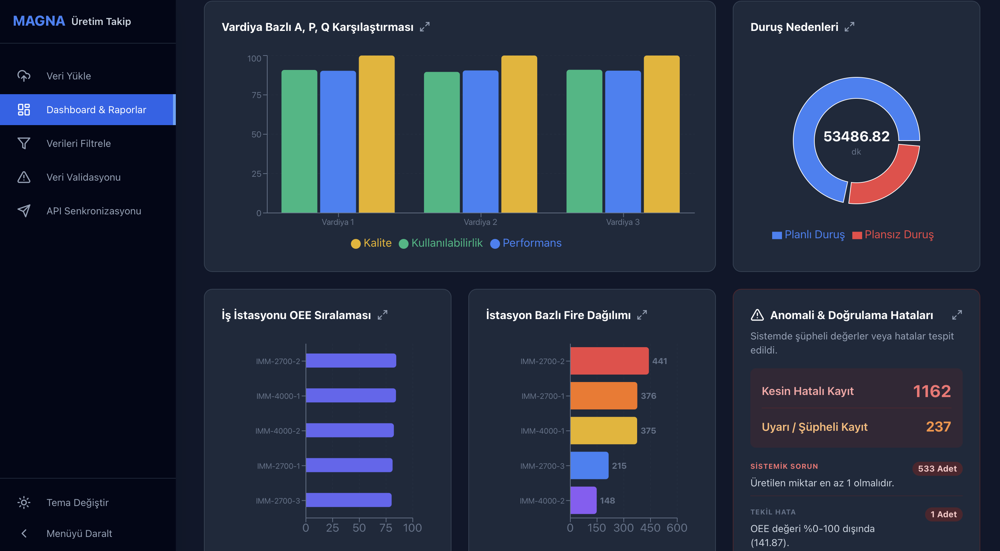
  * **Vardiya APQ Karşılaştırması:** Kullanılabilirlik, Performans ve Kalite oranlarının vardiya bazlı bar grafiği.
  * **Duruş Nedenleri:** Planlı ve plansız duruşların pasta (pie) grafik ile dağılımı.
  * **OEE Sıralaması ve Fire Dağılımı:** Hangi iş istasyonunun ne kadar verimli çalıştığı ve hangi istasyonun daha çok fire (scrap) verdiğini gösteren sıralı grafikler.
  * **Anomali ve Doğrulama Hataları:** Sistemdeki "Kesin Hatalı" ve "Uyarı" statüsündeki kayıtların listesi. (Sistemik ve tekil hata ayrımı ile).
  * *Not: Tüm grafiklerin sağ üstündeki büyütme butonlarına tıklanarak grafikler tam ekran yapılabilir.*

* **Grafik Büyütme (Modal):** <br> 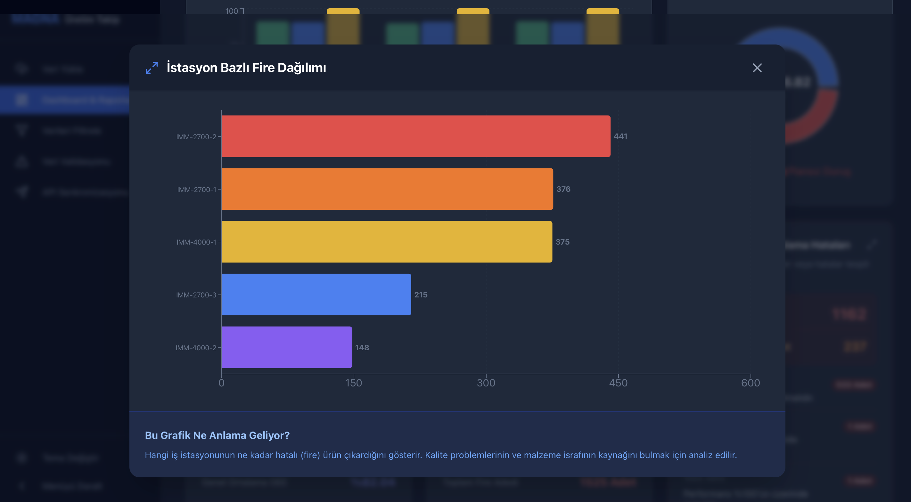 <br> Herhangi bir grafik büyütüldüğünde, grafiğin detaylı görünümü ve alt kısmında "Bu grafik ne anlama geliyor?" şeklinde yöneticiler için okuma rehberi sunulur.

* **Anomali Detaylı Arama:** <br> 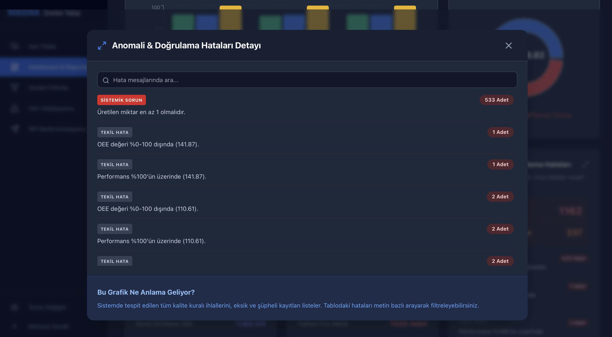 <br> Anomali tablosu büyütüldüğünde, sistemdeki tüm hatalar içerisinde metin bazlı anlık arama (Search) ve filtreleme yapılabilen özel modal ekranı.

### 3. Dinamik Veri Filtreleme ve Dışa Aktarma
Geniş veri setleri içerisinde anında sorgulama yapabilmenizi sağlayan gelişmiş tablo arayüzü:
* **Gerçek Zamanlı Filtreleme:** <br> 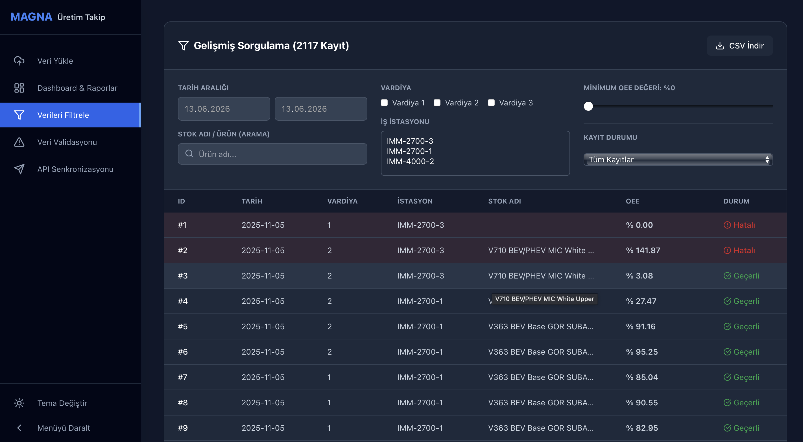 <br> Tarih aralığı, vardiya, iş istasyonu, ürün adı ve OEE değer aralığına göre **anlık (sayfa yenilenmeden)** filtreleme yapılabilir. İstediğiniz kriterdeki verileri filtreledikten sonra tek tıkla **CSV olarak dışa aktarabilirsiniz.**
* **Hatalı Kayıtları Ayıklama:** <br> 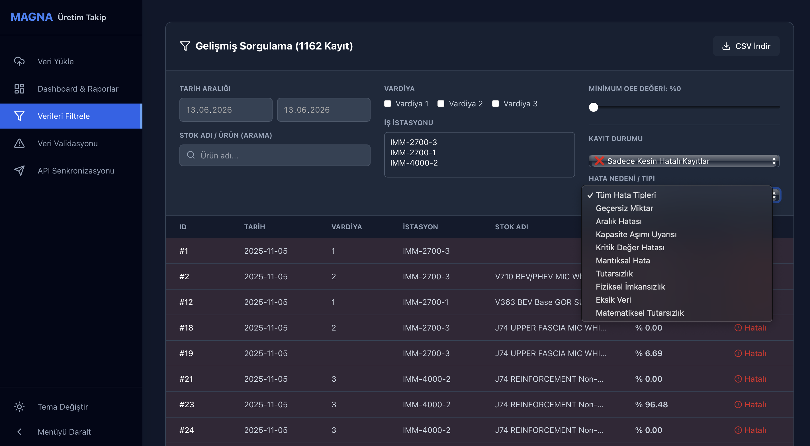 <br> Liste üzerinde sadece hatalı, şüpheli veya tamamen temiz (geçerli) kayıtları ekrana getirmek için özel durum filtrelemesi sunar.

### 4. Veri Validasyonu, Dinamik Kalite Raporu ve Audit Trail
Sistemin kalbini oluşturan, kirli verileri tespit edip onarılmasını sağlayan yönetim paneli:
* **Aksiyon Bazlı Kalite Kontrol (Reddet vs Düzelt):** <br> 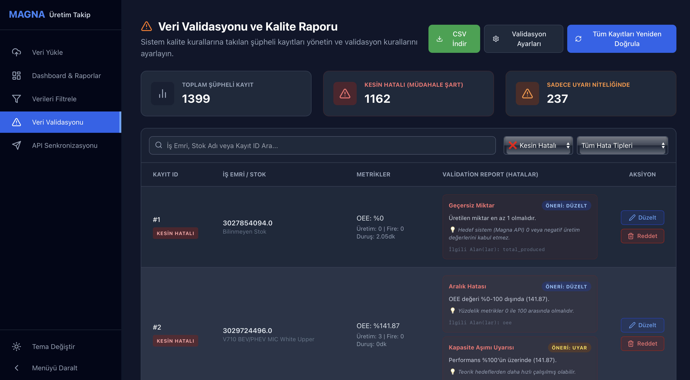 <br> Yüklenen veriler 17 farklı kurala göre test edilir. Projede jenerik bir "Hata (Error)" sınıflandırması yerine, Case Study isterlerine tam sadık kalınarak **Hatalar iki alt aksiyona (Reddet ve Düzelt)** bölünmüştür:
  * **❌ Kesin Hatalı (Reddedilenler):** İzlenebilirliği tamamen kırık veya kurtarılamayacak durumda olan eksik verilerdir (Örn: *İş İstasyonunun boş olması*). Sistem operatöre doğrudan bunu çöpe atmayı önerir. Hedef API'ye **asla gönderilmez**.
  * **✏️ Kesin Hatalı (Düzeltilmesi Gerekenler):** Formata veya kurala uymayan, matematiksel olarak yanlış hesaplanmış ancak operatörün anlık müdahalesi ile onarılabilecek (kurtarılabilir) verilerdir. Arayüzde "Düzelt" dendiğinde A, P, Q değerleri değiştiği an **OEE otomatik hesaplanır**.
  * **⚠️ Uyarı (Şüpheli):** Teorik kapasite aşımı (OEE > %100) gibi fiziksel olarak mümkün ama şüpheli durumlardır. Geçerli kabul edilebilir ancak arayüzde turuncu renkli bir bayrakla işaretlenir.
* **Dinamik Validasyon Ayarları:** <br> 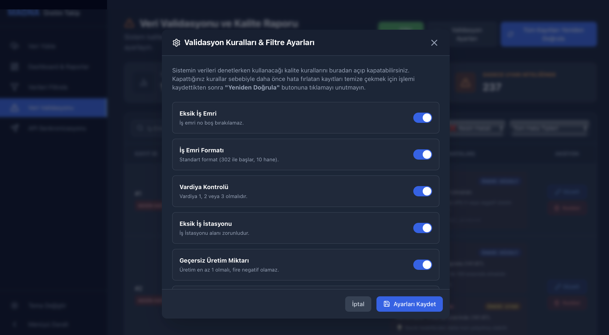 <br> Sistemin kalite denetimi yaparken hangi kuralları dikkate alıp hangilerini görmezden geleceğini (Örn: *Negatif üretime izin ver/verme*) UI üzerinden anlık olarak yönetmenizi sağlar. Ayarlar kaydedildiğinde sistem tüm kayıtları yeniden test eder.

### 5. Hedef API Senkronizasyonu ve Log Kayıtları
Bu bölüm %100 temizlenmiş verilerin hedef REST API'ye (Magna) aktarılmasını ve izlenmesini sağlar.

* **API Senkronizasyonu ve Vardiya Matrisi:** <br> 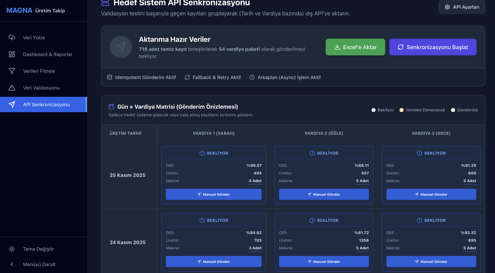 <br> Geçerli olan tüm üretim kayıtlarını Tarih ve Vardiya (1, 2, 3) bazında gruplayarak gösteren önizleme matrisidir. Kullanıcı, "Bekliyor" (Mavi) veya dış sistemden hata dönmüş "Yeniden Denenecek" (Turuncu) kayıtları manuel veya toplu olarak senkronize edebilir. Gönderilen verilerin OEE, Toplam Üretim ve Makine Listesi detayları matris hücrelerinde incelenebilir.

* **API Gönderim Geçmişi (Log Kayıtları):** <br> 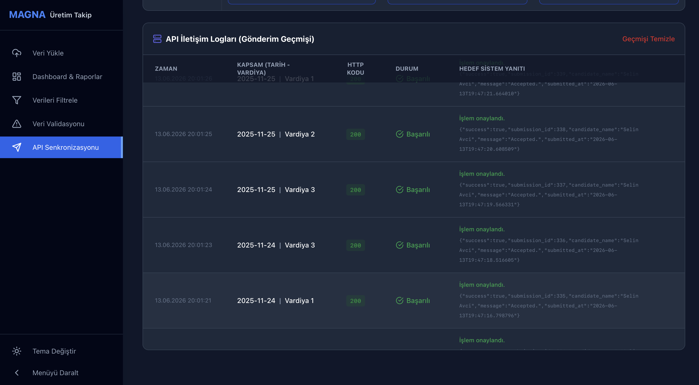 <br> Harici hedef sistemle kurulan tüm ağ iletişimlerinin detaylı olarak kaydedildiği bölümdür. Sistem aşağıdaki hedef API hata kodlarını tanır ve kusursuzca yönetir:
  * **401 (Eksik veya geçersiz API key):** API yetkilendirme hatasıdır. Arayüzdeki "API Ayarları" üzerinden doğru Key girilerek düzeltilir.
  * **413 (İstek gövdesi 10 KB sınırını aştı):** Toplu JSON boyutu çok büyük olduğunda alınır. Sistem bunu algıladığında Batch (Toplu) gönderimden çıkıp Fallback (Tekli/Chunk) moduna geçerek verileri iletir.
  * **422 (Validasyon hatası):** Hedef sistemin kendi iş kurallarına (Örn: Üretim >= 1 olmalıdır) takılan verilerdir. Yanıttaki `detail` alanı loglanarak okunabilir şekilde gösterilir. Sistem bu kayıtları "Yeniden Denenecek" olarak ayırır.
  * **429 (Rate limit aşıldı):** Saniyedeki istek limiti aşıldığında alınır. Sistem bu hatayı aldığında işlemi iptal etmez; **1 dakika bekleyerek** (Circuit Breaker / Pacing) gönderime otomatik olarak kaldığı yerden devam eder.

---

## 🕵️ Tespit Edilen 17 Farklı Hata Tipi ve Validasyon Kuralları
Bu proje, ham verilerin yalnızca yapısal (string, int) formatlarını değil; aynı zamanda **fiziksel, matematiksel ve üretime dayalı domain (iş) kurallarını** da test eden gelişmiş bir motora sahiptir.

Aşağıdaki 17 kural, uygulamanın sol menüsündeki **"Validasyon Ayarları" (Settings)** penceresi üzerinden dinamik olarak **Açılıp / Kapatılabilir** ve kural ihlali durumunda sistemin alacağı aksiyon **(Reddet ❌, Düzelt ✏️, Uyar ⚠️)** arayüzden anında değiştirilebilir. Ayarlar değiştiğinde tüm veritabanı anlık olarak yeniden doğrulanır (Revalidate).

*Aşağıdaki tabloda belirtilen aksiyonlar sistemin varsayılan (Default) atamalarıdır:*

### 📌 Veri Bütünlüğü & Temel Kontroller
| Kural / Metrik | Neden Önemli? (Domain Mantığı) | Varsayılan Aksiyon |
| :--- | :--- | :--- |
| **1. Eksik İş Emri** | Geriye dönük izlenebilirlik (Traceability) için zorunludur. Boş bırakılamaz. | `❌ REDDET` |
| **2. İş Emri Formatı** | SAP/ERP sistemleri iş emirlerini belirli standartlarda (Örn: 302 ile başlayan 10 hane) kabul eder. | `✏️ DÜZELT` |
| **3. Vardiya Kontrolü** | Üretim tesisi 3 vardiya (1,2,3) çalışmaktadır. Vardiya 4 gibi bir değer imkansızdır. | `✏️ DÜZELT` |
| **4. İş İstasyonu ve Ürün** | OEE tamamen "Makine" bazlı bir metriktir. Makine ve üretilen stok bilgisi olmayan bir kayıt geçersizdir. | `❌ REDDET` |
| **5. Boş Metrik Verileri** | Sensör veya operatör kaynaklı anlık veri kaybı olabilir. Mühendis saha loglarından kontrol edip tamamlayabilir. | `✏️ DÜZELT` |
| **6. Tarih Doğrulaması** | Gelecek bir tarih veya hatalı yıl girilmesi (Örn: 2026) kopyalama/insan hatasıdır. Mühendis ait olduğu günü bilerek onarabilir. | `✏️ DÜZELT` |

### 🏭 Fiziksel İmkansızlık & Matematiksel Tutarsızlıklar
| Kural / Metrik | Neden Önemli? (Domain Mantığı) | Varsayılan Aksiyon |
| :--- | :--- | :--- |
| **7. Negatif Üretim / Fire** | Bir makine "-10 adet" ürün veya fire üretemez. Miktarlar mutlak suretle >= 0 olmalıdır. | `✏️ DÜZELT` |
| **8. Fire > Toplam Üretim** | Mantıksal olarak hatalı üretilen (Scrap) parça sayısı, üretilen toplam parçadan fazla olamaz. | `✏️ DÜZELT` |
| **9. Süresiz Üretim** | Çalışma Süresi (Work Time) = 0 iken 500 parça üretim girilmesi fiziksel bir imkansızlıktır. | `✏️ DÜZELT` |
| **10. Uzun Çalışma & Sıfır Ürün**| Makinenin 1 saatten uzun süre açık kalıp (Work Time > 60) hiç ürün vermemesi anomali (boşta çalışma) belirtisidir. | `⚠️ UYAR` |
| **11. Duruş Süresi Kırılımı** | Toplam Duruş doğru girilmiş ancak Planlı/Plansız kırılımı eksik yapılmış olabilir. OEE'yi doğrudan bozmadığı için uyarı verilir. | `⚠️ UYAR` |
| **12. Duruş > Çalışma Süresi** | Bir vardiyada kaydedilen duruş süresi, toplam çalışma süresini aşamaz. | `✏️ DÜZELT` |

### 📊 OEE & Kapasite Sağlaması
| Kural / Metrik | Neden Önemli? (Domain Mantığı) | Varsayılan Aksiyon |
| :--- | :--- | :--- |
| **13. Yüzdelik Aralık** | Availability, Performance ve Quality (A, P, Q) değerleri birer orandır ve %0 - %100 arasında olmalıdır. | `✏️ DÜZELT` |
| **14. OEE Çapraz Kontrolü** | Raporda gelen OEE değeri, kendi A, P, Q değerlerinin çarpımıyla (`A * P * Q`) doğrulanmalıdır. Formül kaymaları burada yakalanır. | `✏️ DÜZELT` |
| **15. Kullanılabilirlik (A) Hatası**| Makine "Duruş (Downtime)" yapmasına rağmen Kullanılabilirlik oranının %100 girilmesi matematiksel olarak yanlıştır. | `✏️ DÜZELT` |
| **16. Kapasite Aşımı (P > 100)** | Performans %105 ise makine teorik (katalog) hızından daha hızlı çalıştırılmış veya hedef süreler yanlış hesaplanmıştır. | `⚠️ UYAR` |

### 🧠 Mimari Tasarım Kararı: Neden Sadece "Hata" Demek Yerine "Reddet" ve "Düzelt" Olarak İkiye Ayırdık?
Case Study'de explicitly (açıkça) belirtilen *"Önerilen aksiyon: reddet / uyar / düzelt"* maddesine istinaden, sistemde jenerik bir "Error/Warning" mantığı kurulmamıştır. Hatalar (Errors) işlem bazlı (action-oriented) olarak ikiye ayrılmıştır:
1. **Reddet (Reject):** Veride izlenebilirlik tamamen kırıksa (Örn: Hangi makinede üretildiği belli değilse) operatörün bunu tahmin etme şansı yoktur, bu yüzden "Reddet" aksiyonu atanır.
2. **Düzelt (Fix):** Mantıksal hatalar (Örn: Firenin üretimden büyük olması) "Kesin Hata"dır ancak operatör Excel/MES kayıtlarına dönüp doğru veriyi bulabilir. Sistem bu veriyi silmez, operatöre UI üzerinden "Düzelt" aksiyonu sunarak kurtarma şansı tanır.

*Not: Üstelik "Validasyon Ayarları" modülü sayesinde hangi hatanın Reddedilip hangisinin Düzeltileceğine kod içinde hardcoded karar verilmemiş, bu kontrol tamamen son kullanıcıya bırakılmıştır.*

### 🧠 Mimari Tasarım Kararı: Hatalı Kayıtlar İçe Aktarılmalı mı (Import), Yoksa Reddedilmeli mi?
Case study'de belirtilen *"Verideki kayıtların hepsini import etmem mi gerekiyor, yoksa sorunluları reddedebilir miyim?"* sorusuna karşılık bu projede **"Tüm kayıtları (şüpheliler dahil) içeri al, ancak hedef API'ye aktarımını kesinlikle bloke et (Zero-Trust)"** yaklaşımı benimsenmiştir.

**Bu Seçimin Mühendislik Gerekçeleri:**
1. **Kullanıcı Deneyimi ve Onarılabilirlik:** Hatalı satırları CSV yüklemesi sırasında reddedip silmek, operatörü orijinal dosyaya dönüp Excel'de satır satır hata aramaya mahkum eder. Bunun yerine kirli veriler sisteme `error` veya `warning` etiketiyle alınır. Operatör "Veri Validasyonu" ekranında hatanın nedenini okur ve **"Düzelt"** butonuyla Excel'e dönmeden hatayı doğrudan sistemde onarabilir.
2. **Kök Neden ve Sistemik Analiz:** Dashboard ekranındaki "Anomali Analizi" özelliği, ancak hatalı veriler izole bir şekilde veritabanında tutulursa çalışabilir. Verileri kapıda (import sırasında) reddetseydik, örneğin *"IMM-1 istasyonundaki operatörler sürekli OEE değerini eksik giriyor"* gibi kronik/sistemik bir kalite problemini (10+ tekrar eden hata) asla tespit edemezdik.
3. **Hedef Sistemin Kusursuz Korunması:** Veritabanına kirli veri girse dahi, `ApiSync` (Gönderim) modülü sadece ve sadece validasyon testinden %100 başarıyla geçmiş (`is_valid = True`) temiz verileri hedefe yollar. Bu mimari sayesinde harici (hedef) sistem mükemmel şekilde korunurken, iç kullanıcının veri düzeltme/ayrıştırma konforu en üst seviyeye çıkarılmıştır.

---

## � API Entegrasyon Akışı (Hedef Sisteme Gönderim)
Validasyonu başarıyla geçen veriler API üzerinden aşağıdaki mimariyle gönderilir:

1. **Grouping (Gruplama):** Temizlenen veriler "Tarih ve Vardiya" kırılımında gruplanıp OEE ve Toplam Üretim ortalamaları hesaplanarak tek JSON objesi haline getirilir.
2. **Idempotency (Çift Kayıt Koruması):** Veri dış API'ye gönderilmeden önce `SyncLog` (Geçmiş) tablosu kontrol edilir. Aynı verilerin (Aynı Vardiya + Aynı OEE/Üretim rakamı) ikinci kez hedefe yollanması engellenir.
3. **Batch & Fallback (Toplu ve Tekil Gönderim):** Hedef sisteme 20'li listeler (Batch) halinde istek atılır. Hedef sistem listeyi kabul etmeyip `422 Unprocessable Entity` dönerse, sistem **Fallback** moduna geçip listeyi parçalayarak tek tek (Single) gönderir.
4. **Exponential Backoff & Pacing:** Ağ hatalarında (`5xx`) veya Rate Limit aşımında (`429`), sistem hedef sunucuyu yormamak için katlanarak artan (2s, 4s, 8s veya 60s) bekleme süreleri uygulayarak (Circuit Breaker) isteği tekrar eder.
5. **Background Tasks (Asenkron Gönderim):** Aktarım işlemi FastAPI arkaplan görevleriyle yürütülür, kullanıcı arayüzü (UI) kilitlenmez. İşlem sonuçları `sync_logs` tablosuna (HTTP Status, Request/Response payload) kalıcı olarak yazılır.

---

## 🗄️ Veritabanı Şeması (Database Structure)
Proje, kurulum kolaylığı ve taşınabilirlik (MVP hedefine uygunluk) açısından **SQLite** veritabanı ile çalışmaktadır. Arka planda `SQLAlchemy ORM` kullanılarak iki ana tablo tasarlanmıştır:

**1. `production_records` (Üretim Kayıtları Tablosu):**
MES sisteminden yüklenen ham verilerin, validasyon sonuçlarının ve kullanıcı düzenlemelerinin tutulduğu omurga tablodur.
* `record_id`: Birincil Anahtar (Primary Key).
* `date`, `shift`, `workstation_name` vb.: Üretim temel boyutları (String/Integer).
* `oee`, `total_produced`, `down_time` vb.: Üretim ve performans metrikleri (Float/Integer).
* `is_valid` (Boolean): Kaydın hedef API'ye gitmeye %100 uygun olup olmadığını belirtir.
* `record_status` (String): Kaydın arayüzdeki hiyerarşik durumunu belirler (`valid`, `warning`, `error`).
* `validation_errors` (JSON/Text): Kayıtta tespit edilen kalite sorunlarını (Reddet/Düzelt/Uyar seviyeleriyle birlikte) saklar.
* `audit_trail` (JSON/Text): Kullanıcının arayüzden yaptığı düzeltmelerin "Eski Değer ➔ Yeni Değer" loglarını zaman damgasıyla tutar.

**2. `sync_logs` (API İletişim Logları Tablosu):**
Hedef sistemle (Magna API) kurulan ağ iletişiminin kanıtlarını (Audit) tutan tablodur. Çift gönderimi (Idempotency) engellemek için de referans olarak kullanılır.
* `id`: Birincil Anahtar.
* `production_date` & `shift`: Hangi vardiya paketinin gönderildiğini belirtir.
* `payload` (JSON/Text): Hedef sisteme POST edilen paket verisi.
* `status_code` & `response_data`: API'den dönen HTTP kodu (200, 422, 429 vb.) ve hata/başarı mesajı.
* `is_success` (Boolean): Gönderimin başarılı olup olmadığını belirler.
* `timestamp` (DateTime): İşlemin gerçekleştiği an.

---

## ️ Kullanılan Kütüphaneler ve Seçim Gerekçeleri

**Backend:**
* **FastAPI:** Yüksek hızlı, asenkron (`BackgroundTasks`) çalışmayı desteklediği ve otomatik Swagger/OpenAPI dokümantasyonu sunduğu için tercih edilmiştir.
* **Pandas:** Büyük CSV dosyalarını iterasyon (`iterrows`) yerine vektörel olarak belleğe almak (`to_dict('records')`) ve 100K+ veriyi hızla işlemek için kullanılmıştır.
* **SQLAlchemy & SQLite:** Ekstra bir sunucu veya Docker kurulumu gerektirmeden, MVP için en ideal ve taşınabilir SQL çözümünü sunduğu için seçilmiştir.
* **Requests:** Hedef REST API'ye HTTP POST/GET çağrıları atmak için standart ve güvenilir bir çözüm olarak kullanıldı.

**Frontend:**
* **React.js & Vite:** Komponent bazlı geliştirme ve inanılmaz hızlı Hot-Module-Reloading (HMR) avantajı sebebiyle seçilmiştir.
* **Tailwind CSS:** Kapsamlı ve hızlı stil yazımı, hazır utility sınıfları ve mükemmel **Dark Mode (Gece Modu)** uyumu için tercih edilmiştir.
* **Recharts:** Dashboard üzerindeki OEE trendleri, Pareto grafikleri ve Şelale (Waterfall) kayıp analizlerini kolay ve esnek çizmek için kullanılmıştır.
* **Axios:** REST API'den verileri çekerken HTTP isteklerini modüler ve pratik yönetmek için eklenmiştir.

---

## 🌟 Ekstra Geliştirmeler (Bonus İsterler)
Case dokümanındaki taleplere ek olarak aşağıdaki "Senior" seviye mühendislik pratikleri projeye dahil edilmiştir:
* **Genel Geçmiş Paneli (Audit Trail) ve Kayda Git:** Veritabanındaki tüm kullanıcı düzeltmelerini tek bir modalda, kronolojik olarak listeyen gelişmiş log panelidir. Logun yanındaki "Kayda Git" butonu ile binlerce veri arasından filtreler sıfırlanıp direkt olarak düzeltilen satıra otomatik odaklanılır.
* **Dinamik Aksiyon Yönetimi:** Tüm validasyon kurallarının açık/kapalı durumu ve hata seviyeleri (Reddet, Uyar, Düzelt) arayüzden değiştirilebilir.
* **Otomatik OEE Formülizasyonu:** "Düzelt" modülünde kullanıcı `A, P, Q` verilerini değiştirirken, OEE değeri anlık (real-time) hesaplanarak ekrana yansır.
* **100K+ Satır Performansı:** Pandas `to_dict` ile RAM optimizasyonu sağlanmıştır.
* **Yapay Zeka (AI) Şeffaflığı:** Süreç boyunca karşılaşılan zorluklarda veya mimari tartışmalarda yapay zeka araçlarından nasıl destek alındığı `.ai_usage` klasöründe paylaşılmıştır.
* **Dışa Aktarma (Export):** İlgili raporlar ve gönderilmeyi bekleyen vardiyalar Excel/CSV ve PDF formatında sistemden indirilebilir.
* **Unit Testing:** Validasyon mantığının kalbini test etmek için temel `pytest` modülleri (`test_main.py`) yazılmıştır.

---

## ⏳ Yapılamayan / Vakit Yetmeyen Kısımlar
* Gerçek zamanlı (WebSocket tabanlı) bildirim sistemi tasarlanabilirdi. API'ye gönderim arka planda bittiğinde ekrana anında Toast/Notification basılabilirdi, mevcut durumda Polling (2sn'de bir ping atma) kullanıldı.
* Kullanıcı Yetkilendirme (RBAC): Operatör, Mühendis ve Yönetici bazlı giriş (Login/JWT) modülü eklenemedi.

---

## 🔮 Daha Fazla Zaman Olsaydı Neler Geliştirilirdi?
1. **Kestirimci Bakım (Predictive AI):** Geçmiş duruş süreleri ve OEE trendlerini bir Machine Learning (Makine Öğrenmesi) algoritmasına vererek, "IMM-2700 nolu makine önümüzdeki 3 gün içinde planlı bakıma alınmalı" tahmini üreten bir servis eklenebilirdi.
2. **PostgreSQL/Redis Geçişi:** Çok daha büyük ölçekli ve çoklu fabrika desteği için veritabanı SQLite yerine PostgreSQL'e, arkaplan görevleri ise Celery/Redis ikilisine geçirilirdi.
3. **Dockerize Etmek:** Projenin tek bir komutla (`docker-compose up`) izole bir container içinde tüm modülleriyle ayağa kalkması sağlanırdı.
